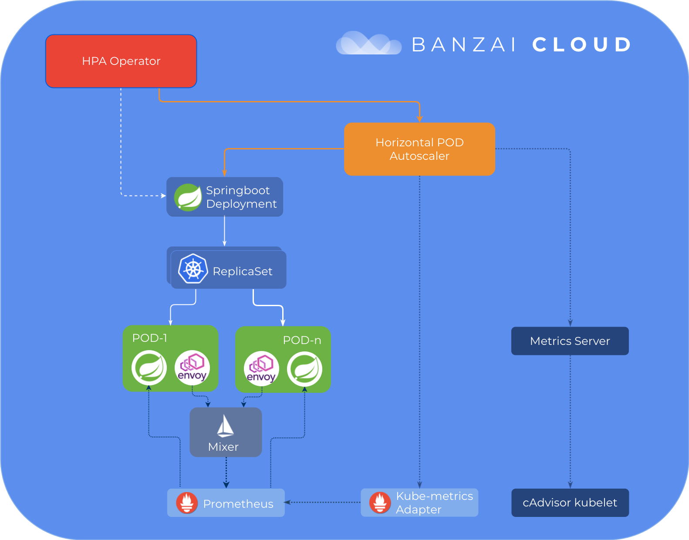

## 基于自定义Istio指标的Pod水平自动缩放

[Pipeline](https://github.com/banzaicloud/pipeline)的核心功能之一，Banzai Cloud的应用程序和devops容器管理[平台](https://beta.banzaicloud.io/)，是多维的并可以基于默认和自定义指标进行自动调节。 在我们引入自定义指标后，我们选择了通过[Prometheus适配器](https://github.com/DirectXMan12/k8s-prometheus-adapter)从**Prometheus**收集指标。 从那时起，我们的许多客户开始使用Hoizontal Pod Autoscaling，他们中的大多数人只对基本的CPU和内存指标感到满意。

我们一直都知道这不是一个理想的解决方案，我们一直在努力寻求更灵活的解决方案，以便：

- 基于自定义**Prometheus指标**的扩展
- 为更复杂的**Prometheus查询**提供扩展支持

随着我们的开源[Istio operator](https://banzaicloud.com/blog/istio-operator/)的发布以及在[Pipeline平台](https://beta.banzaicloud.io/)上广泛引入基于Istio的服务网格(https://beta.banzaicloud.io/)，我们也提供了根据自定义的Istio指标的自动缩放功能。 Prometheus现在提供网络指标，延迟，故障率以及更多指标(默认情况下从Istio中删除)。 我们的[HPA operator](https://banzaicloud.com/blog/k8s-hpa-operator/)根据这些指标决定是否扩展。

但是，在使用[Prometheus Adapter](https://github.com/DirectXMan12/k8s-prometheus-adapter)时，我们的方法已不再可行，因此我们决定探索替代方案。

> 如果您错过了我们关于[Pipeline](https://github.com/banzaicloud/pipeline)平台所支持和自动化不同类型的**自动缩放**功能的系列博客，请查看这些早先的帖子：
>
> - [Autoscaling Kubernetes集群](https://banzaicloud.com/blog/k8s-cluster-autoscaler/)
> - [Vertical pod autoscaler](https://banzaicloud.com/blog/k8s-vertical-pod-autoscaler/)
> - [自定义指标上的水平自动缩放Kubernetes部署](https://banzaicloud.com/blog/k8s-horizontal-pod-autoscaler/)
> - [Horizontal Pod Autoscaler Kubernetes Operator](https://banzaicloud.com/blog/k8s-hpa-operator/)
> - [重新加载水平Pod自动调节器操作员](https://banzaicloud.com/blog/k8s-hpa-operator-reloaded/)

### 太长;求总

- [Pipeline](https://github.com/banzaicloud/pipeline)及其[HPA Operator](https://banzaicloud.com/blog/k8s-hpa-operator/)中对重新设计的自定义指标支持的介绍。
- 使用**来自Prometheus的Istio指标**自动调整Spring Boot部署的示例
- 深入了解添加自定义指标后发生了什么
- 切换到另一个**自定义指标适配器 **，[kube-metrics-adapter](https://github.com/zalando-incubator/kube-metrics-adapter)的总结

### 重新支持自定义指标

由于上面列出的原因，我们决定使用另一个**自定义指标适配器**，[kube-metrics-adapter](https://github.com/zalando-incubator/kube-metrics-adapter)。

**kube-metrics-adapter** 是一种通用指标适配器，可以从多个来源收集和提供指标。对于每个源，都有一个`Collector`实现;目前，我们对其**普罗米修斯**收集器最感兴趣。

`Prometheus Collector`是一个通用收集器。它将**Prometheus** 查询映射到可由**HPA** 控制器用于部署自动扩展的度量标准。它的方法不同于**Prometheus Adapter** ，它具有预定义的规则集 - 包含针对**Prometheus** 运行的查询，用于将指标转换为自定义指标 - 定期执行。获取所有匹配的指标标准(因为这些查询必须是通用的并且定位所有pod和部署)，并作为自定义指标进行转换和公开。相比之下，“Prometheus collector”仅收集自定义查询返回的指标结果，其定义因部署而异，并且仅针对单个部署/ pod或服务，从而减少了存储的指标总数。该解决方案的一个缺点是，目前，用户应该避免执行性能不佳的查询。

### 使用ISTIO自动伸缩Spring Boot应用



我选择了流行的`spotguides`，[基于MySQL的Sprint Boot 应用](https://github.com/spotguides/spring-boot)，以便在MySQL服务器旁，快速启动一个轻量级Web应用程序容器。 我使用[Banzai Pipeline Beta](https://beta.banzaicloud.io/)，它支持在六个云提供商中或在本地快速启动Kubernetes集群。 Prometheus & Grafana Monitoring以及Istio是默认功能，可以通过UI开关轻松打开(Pipeline处理其余部分)。 在这个例子中，我将在Google Cloud上启动一个Kubernetes集群，并打开**Monitoring and Service Mesh**，并在其上部署**Spring Boot Spotguide**。 群集创建是我们的`spotguide`向导的一部分，但是，因为`Service Mesh`是**Pipeline**中的一个相对较新的功能，我们不能(迄今为止)从`spotguide`的流程中启用它， 所以我们必须事先创建集群。

我在[这个视频](https://banzaicloud.com/img/blog/k8s-hpa-prom-istio/spring_boot_spotguide.mp4)中记录了这些步骤：

一旦你的`Spring Boot`容器和`MySQL`服务器启动并运行，你就可以从**Spotguid 总览**打开演示程序``https://spring-boot-custom-metrics-demo.sancyx5g25.sancyx.beta.banzaicloud.io/actuator/health/kubernetes` 。这是一个演示应用程序，是典型的`Spring` Web应用程序。我们已经创建了一个GitHub 代码库，你可以在里面找到示意代码（就像我们的其他`spotguides`一样）。默认情况下，应用程序URL将仅返回运行状况检查状态，该状态连接到`Kubernetes`活动和准备情况检查。然后，JVM指标将暴露给**Prometheus**，并且repo将集成到我们的CI/CD流中，因此，一旦您提交业务逻辑，它将自动部署到集群。在[这里](http://localhost/blog/spotguides-revisited/)阅读更多关于我们的spotguides。

您可以从群集列表或详细信息页面下载`Kubernetes`配置，以便稍后从本地计算机获取对群集的`kubectl`访问权限。

我正在使用`hey`工具（`go get -u github.com/rakyll/hey`）来生成针对Spring应用程序的负载;下面的命令将`每秒发出50个请求`，总计`10000`个请求：

```bash
hey -n 10000 -q 50 https://spring-boot-custom-metrics-demo.sancyx5g25.sancyx.beta.banzaicloud.io/actuator/health/kubernetes
```

现在，打开监控（我们的**Spotguide摘要** 或群集详细信息页面中提供的链接）以查看可用的指标并确定您的**Prometheus** 查询。 因为我们启用了Service Mesh，所有网络通信都将通过Envoy代理，将指标发送到Istio遥测服务，该服务由**Prometheus**抓取。

我将基于我的示例，查询基于**istio_requests_total **指标，该指标与Spring容器相关：

```bash
sum(rate(istio_requests_total{destination_service="spring-boot-custom-metrics-demo-spotguide-spring-boot.default.svc.cluster.local",destination_service_name="spring-boot-custom-metrics-demo-spotguide-spring-boot",destination_service_namespace="default",destination_workload="spring-boot-custom-metrics-demo-spotguide-spring-boot"}[1m]))
```

请务必添加相应的标签过滤器，以便专门选择与您的pod/部署相关的指标。

从部署列表页面上的**Horizontal Pod Autoscaler**菜单中选择*spring-boot-custom-metrics-demo-spotguide-spring-boot* 部署，以访问*HPA Edit*页面。 在那里，您可以通过输入自定义指标或查询的名称来设置cpu，内存和自定义指标。

现在，如果您在更长的时间内生成另一个负载（50个请求/秒），则应在属于部署的HPA中增加副本计数：

```bash
hey -n 50000 -q 50 https://spring-boot-custom-metrics-demo.sancyx5g25.sancyx.beta.banzaicloud.io/actuator/health/kubernetes

...

kubectl get hpa

NAME                                                   REFERENCE                                                 TARGETS      MINPODS   MAXPODS   REPLICAS   AGE
spring-boot-custom-metrics-demo-spotguide-spring-boot   Deployment/spring-boot-custom-metrics-demo-spotguide-spring-boot   245866m/40   1         10        7          80s
```

加载结束后，副本数将慢慢减少到默认的最小值：

```bash
kubectl get hpa

NAME                                                   REFERENCE                                                 TARGETS   MINPODS   MAXPODS   REPLICAS   AGE
spring-boot-custom-metrics-demo-spotguide-spring-boot   Deployment/spring-boot-custom-metrics-demo-spotguide-spring-boot   266m/40   1         10        1          32m
```

### BEHIND THE SCENES

### 背后的场景

让我们深入了解使用Pipeline UI向部署添加自定义指标时幕后发生的情况。 这个流程非常类似于资源指标，您可能会从之前的一系列帖子中熟悉这些指标，但是现在，让我们关注与自定义指标相关的API。

Pipeline UI使用HPA API创建/更新指标：

```bash
PUT {{pipeline_url}}/api/v1/orgs/:orgId/clusters/:clusterId/hpa

{
  "scaleTarget": "example-deployment-name",
  "minReplicas": 1,
  "maxReplicas": 10,
  "customMetrics": {
    "customMetricName": {
      "query": "sum({kubernetes_pod_name=~\"^example-deployment-name-pod.*\",__name__=~\"example-metric-name\"})",
      "targetAverageValue": "100"
    }
  }
}
```

如果要指定绝对值，可以使用`targetValue`而不是`targetAverageValue`。 不同之处在于，`targetAverageValue`使用当前pod副本计数对获取的度量值进行平均。

[Pipeline]（https://github.com/banzaicloud/pipeline）实际上做的是为您的部署添加以下注释：

```bash
    hpa.autoscaling.banzaicloud.io/maxReplicas=10
    hpa.autoscaling.banzaicloud.io/minReplicas=1
    prometheus.customMetricName.hpa.autoscaling.banzaicloud.io/query=sum({kubernetes_pod_name=~\"^example-deployment-name-pod.*\",__name__=~\"example-metric-name\"})
```

所有这些都是通过[HPA operator](https://github.com/banzaicloud/hpa-operator)实现的，它根据部署注释管理HPA资源。 [Pipeline](https://github.com/banzaicloud/pipeline)在群集创建完成后，通过一个post hook，部署[HPA operator](https://github.com/banzaicloud/hpa-operator)，然后，如果`metrics.api`尚未注册，则部署`kube-metrics-adapter`和`metrics-server`。 此过程可能会有所不同，具体取决于您的云提供商和K8s版本，这些版本可能已安装了某些功能。在我们的例子中，新创建的HPA对象将如下所示：

```yaml
apiVersion: v1
items:
- apiVersion: autoscaling/v1
  kind: HorizontalPodAutoscaler
  metadata:
    annotations:
    ...
      autoscaling.alpha.kubernetes.io/current-metrics: '[{"type":"Object","object":{"target":{"kind":"Pod","name":"example-deployment-name-customMetricName","apiVersion":"v1"},"metricName":"customMetricName","currentValue":"222m"}}]'
      autoscaling.alpha.kubernetes.io/metrics: '[{"type":"Object","object":{"target":{"kind":"Pod","name":"example-deployment-name-customMetricName","apiVersion":"v1"},"metricName":"customMetricName","targetValue":"40"}}]'
      metric-config.object.customMetricName.prometheus/per-replica: "true"
      metric-config.object.customMetricName.prometheus/query: sum({kubernetes_pod_name=~\"^example-deployment-name-pod.*\",__name__=~\"example-metric-name\"})
    ...
  spec:
    maxReplicas: 10
    minReplicas: 1
    scaleTargetRef:
      apiVersion: apps/v1
      kind: Deployment
      name: example-deployment-name
  status:
    currentReplicas: 1
    desiredReplicas: 1
kind: List
metadata:
  resourceVersion: ""
  selfLink: ""
```

请注意，自定义度量标准是`Object`类型，并绑定到名为`example-deployment-name-customMetricName`的Pod资源。 `Kube-metrics-adapter`也使用注释查询来获取度量值，该值在以下端点公开`/apis/custom.metrics.k8s.io/v1beta1/namespaces/default/pods/example-deployment-name -customMetricName/customMetricName`，并且它正是HPA控制器将要查找的位置：

```bash
$ kubectl get --raw "/apis/custom.metrics.k8s.io/v1beta1/namespaces/default/pods/*/customMetricName" | jq .
{
  "kind": "MetricValueList",
  "apiVersion": "custom.metrics.k8s.io/v1beta1",
  "metadata": {
    "selfLink": "/apis/custom.metrics.k8s.io/v1beta1/namespaces/default/pods/%2A/customMetricName"
  },
  "items": [
    {
      "describedObject": {
        "kind": "Pod",
        "namespace": "default",
        "name": "example-deployment-name-customMetricName",
        "apiVersion": "v1"
      },
      "metricName": "customMetricName",
      "timestamp": "2019-03-13T20:23:32Z",
      "value": "222m"
    }
  ]
}
```

**自动缩放**愉快！
